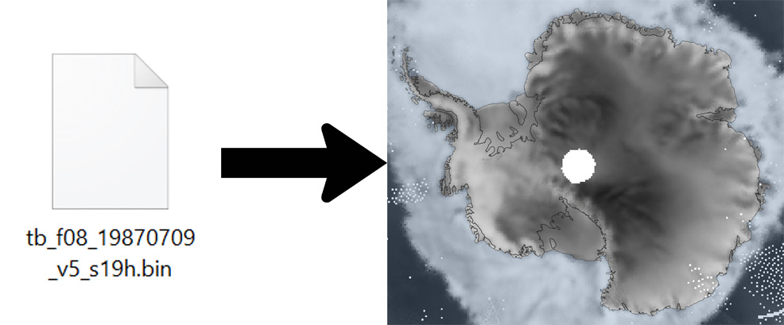

# NSIDC_file_reader

Scripts for reading and exporting various National Snow &amp; Ice Data Center ([NSIDC](https://nsidc.org/)) flat binary (.bin) data files.

Many of NSIDC's files comes with IDL .pro scripts to read and/or plot them, but without IDL (a closed-source programming environment), you have to just figure it out yourself. Here are some simple Python scripts with command-line interfaces for easily reading and exporting the data yourself. You shouldn't need to edit the files (unless you want to develop it further or work out a bug, in which case please submit a pull request!), you should just be able to run them from the command line.

Two files are included here. They both have command-line interfaces, or you can import the functions from the scripts and use them with your Python code.

### convert_bin_to_gtif.py
    usage: convert_bin_to_gtif.py [-h] [-dest DEST] [-resolution RESOLUTION]
                                  [-hemisphere HEMISPHERE] [-nodata NODATA]
                                  [-header_size HEADER_SIZE]
                                  [-element_size ELEMENT_SIZE]
                                  [-output_type OUTPUT_TYPE]
                                  [-multiplier MULTIPLIER] [--signed] [--verbose]
                                  src
    
    Outputs a geo-referenced TIF (.tif) from an NSDIC flat binary (.bin) data
    file.
    
    positional arguments:
      src                   Source file (.bin)
    
    optional arguments:
      -h, --help            show this help message and exit
      -dest DEST            Destination file (.tif). Default: Write the same
                            filename in the same location with a .tif extension
                            rather than .bin.
      -resolution RESOLUTION, -r RESOLUTION
                            Resolution (km): 6.25, 12.5, or 25. If omitted, it is
                            interpreted from the file name. If cannot be
                            interpreted, defaults to 25 km. Check your NSIDC data
                            source documentation.
      -hemisphere HEMISPHERE
                            Hemisphere: one letter, N or S. If omitted, it is
                            interpreted from the file name. If cannot be
                            interpreted, defaults to 'N'.
      -nodata NODATA, -nd NODATA
                            Nodata value. Can be a number, or 'None' (without the
                            quotes). (Default: None)
      -header_size HEADER_SIZE, -hs HEADER_SIZE
                            Size of .bin file header (in bytes). (Default: 0)
      -element_size ELEMENT_SIZE, -es ELEMENT_SIZE
                            Size of each numerical .bin data element (in bytes).
                            Typically 1 or 2 for NSIDC files. (Default: 2)
      -output_type OUTPUT_TYPE, -ot OUTPUT_TYPE
                            Output data type: 'int' or 'float'. Default 'float'.
      -multiplier MULTIPLIER, -m MULTIPLIER
                            Use a multiplier. With 'auto', defaults to 1 (no mod)
                            for integer output and 0.1 for floating-point (2731 ->
                            273.1). If you want to use a different multiplier, put
                            the number here.
      --signed, -s          If set, read binary data as signed numbers. (Default:
                            unsigned)
      --verbose, -v         Increase output verbosity.

### read_bin.py
    usage: read_bin.py [-h] [-resolution RESOLUTION] [-hemisphere HEMISPHERE]
                       [-header_size HEADER_SIZE] [-element_size ELEMENT_SIZE]
                       [-output_type OUTPUT_TYPE] [-multiplier MULTIPLIER]
                       [--signed]
                       src
    
    Reads an NSIDC .bin file and outputs the array contents. Use
    'convert_bin_to_gtif.py' to output to a GeoTiff. This will just spit the
    numbers onto a screen. In order to output to a space-delimited text file, just
    route the stdout into a file. Example: 
    
                                $ python read_bin.py infile.bin > outfile.txt
    
    Read the NSIDC documentation for your data product in order to
    choose the correct parameters listed below.
    
    positional arguments:
      src                   Source file (.bin)
    
    optional arguments:
      -h, --help            show this help message and exit
      -resolution RESOLUTION, -r RESOLUTION
                            Resolution (km): 6.25, 12.5, or 25. If omitted, it is
                            interpreted from the file name. If cannot be
                            interpreted, defaults to 25 km. Check your NSIDC data
                            source documentation.
      -hemisphere HEMISPHERE
                            Hemisphere: N or S. If omitted, it is interpreted from
                            the file name. If cannot be interpreted, defaults to
                            'N'.
      -header_size HEADER_SIZE, -hs HEADER_SIZE
                            Size of .bin file header (in bytes.) (Default: 0)
      -element_size ELEMENT_SIZE, -es ELEMENT_SIZE
                            Size of each numerical .bin data element, in bytes.
                            Most NSIDC files use 1- or 2-byte numbers. Check the
                            documentation of the dataset. (Default: 2)
      -output_type OUTPUT_TYPE, -ot OUTPUT_TYPE
                            Output data type: 'int' or 'float'. Default 'int'.
      -multiplier MULTIPLIER, -m MULTIPLIER
                            A multiplier to create the output numbers. Any number,
                            or 'auto'. With 'auto', defaults to 1 for integers (no
                            modification) and 0.1 for floating-point (2731 becomes
                            273.1, e.g.). Or, specify your own multiplier here.
      --signed, -s          Read bin as signed data. Default to unsigned.

###Using code in your own Python scripts:

If you'd like to use the data without having to export them to .txt or .tif files (who really needs multiple data versions), you can import the needed functions into your own Python code. To do this, place the .py files into your source directory or in a place where they're included in the [PYTHONPATH](https://bic-berkeley.github.io/psych-214-fall-2016/using_pythonpath.html).

Then in your code, import the following functions (as needed):

    from read_bin import read_NSIDC_bin_file
    from convert_bin_to_gtif import output_bin_to_gtif, output_gtif

The readbin.read_NSIDC_bin_file takes the name of the .bin file, and returns a numpy array with the data contents of the file. It ignores the header information. (If you need the header information, I'm considering writing another function that'll parse it and return that, it just isn't in there yet).

The
    convert_bin_to_gtif.output_bin_to_gtif()
function takes the name of a .bin file and writes out the geo-referenced .tif equivalent, same as the command-line options do.

The
    convert_bin_to_gtif.output_gtif()
function takes a 2D numpy array (in the same grid shape as one of the NSIDC .bin files), and outputs a geotif from it. This is handy if you have derived products from the NSIDC files (such as, say, a 1/0 mask of sea ice coverage based on concentrations) and wish to product a geo-referenced geotiff from it.

The parameters (required and optional) for these functions are outlined in the code, just open the Python scripts and look there.

###System Requirements:

You'll need a working python3 installation with the following libraries installed:

  * **numpy**
  * **osgeo**, with an installed Geospatial Data Abstraction Library [[GDAL](https://pypi.org/project/GDAL/)] library and python bindings

###Notes:

These functions have **not** been exhaustively tested for all different types of NSIDC .bin data products. They have been tested and seem to work with [NSIDC-0001](https://nsidc.org/data/NSIDC-0001/), [NSIDC-0051](https://nsidc.org/data/nsidc-0051), and [NSIDC-0079](https://nsidc.org/data/nsidc-0079) files in both the Northern & Southern hemispheres. If you are using other .bin data files for which this code doesn't seem to work, please submit an issue request, or just shoot me an email (see below), and I will try to update the code to accomodate. (Or better yet, submit a pull request and suggest fixes to the code yourself!)

The [convert_bin_to_gtif.py](#convert_bin_to_gtifpy) file depends upon the [read_bin.py](#read_binpy) file. They should be kept in the same directory.

I have not yet implemented writing GeoTiff's from NSIDC EASE grid data products (just polar stereo so far). It isn't hard to do, I just haven't done it yet. If you need to create GeoTiff's from EASE Grid data products, just let me know and I'll toss that feature in there.

Next Step: I plan to put necessary metadata about each NSIDC data product into a machine-readable .csv metadata file, to ease including other products (such as the EASE grid binary products) and having them automatically converted. Will get to it at some point.

###Credit and Lisense

Distributed freely under the [GPL3.0 license](https://www.gnu.org/licenses/gpl-3.0.en.html).

All the usual exclusions apply. I'm not responsible if, say, this code accidentally crashes your computer or an asteroid implodes your roof the very moment you run the script (though that would be pretty cool... I hope you're okay!). The code is presented as-is, I make updates whenever I feel like it. If you make improvements, feel free to contribute by making a Github pull request and adding your changes, or just email me.

Created by Mike MacFerrin, University of Colorado ([email](mailto:michael.macferrin@colorado.edu)).

If this code is used in a research work or publication, a quick acknowledgement at the end/footnote of the work is requested.

If you would like to show your appreciation by buying me a coffee, feel free to hit my [PayPal](https://paypal.me/MikeMacFerrin) or [Venmo](http://www.venmo.com/Mike-MacFerrin). :blush: